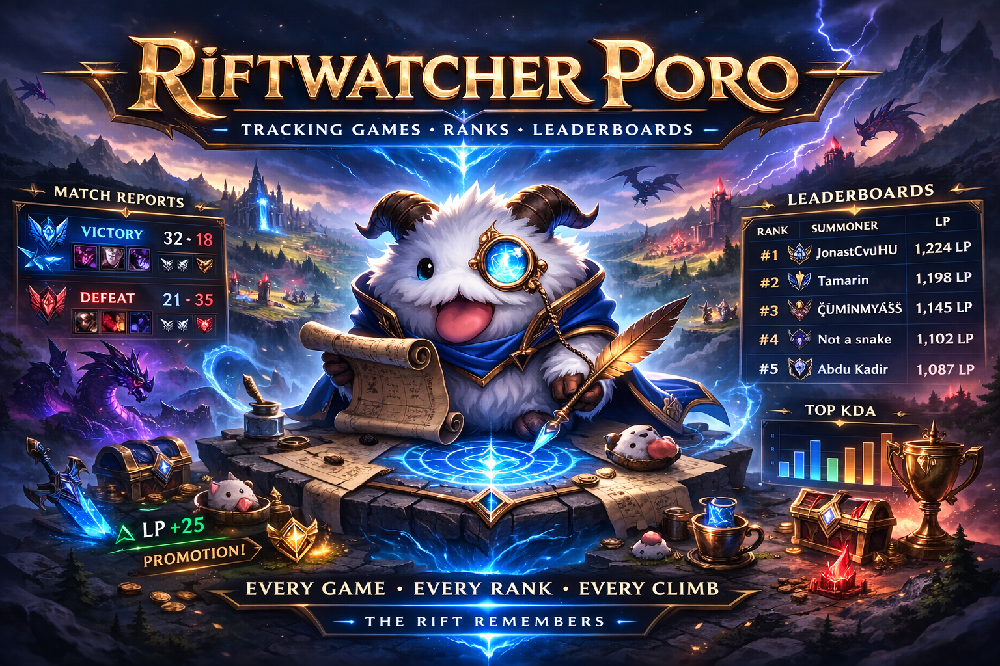

# Riftwatcher Poro

<p align="center">
  
</p>

Riftwatcher Poro is a Discord bot for tracking ranked League of Legends performance for a list of tracked Riot IDs.
It maintains daily and weekly scoreboard messages, posts match recaps, and posts rank up/down alerts.

## License

Riftwatcher Poro is source-available for non-commercial use under the PolyForm Noncommercial License 1.0.0. See `LICENSE.md`.

Commercial use is not granted by this license. Contact the project maintainer for separate commercial permission.

## Disclaimer

Riftwatcher Poro is an independent community project and is not endorsed by, directly affiliated with, maintained, authorized, or sponsored by Riot Games.
Riot Games, League of Legends, and all associated properties are trademarks or registered trademarks of Riot Games, Inc.
This project does not use Riot's official logos.

## Runtime Entry

- Run locally: `python -m src.app`
- Railway/Procfile worker: `python -m src.app`

## Self-Hosting

Riftwatcher Poro is intended to be self-hosted as one bot instance per Discord server/community. Each deployment uses its own Discord bot token, Riot API key, Postgres database, channel IDs, and tracked player list.

Start with:

- `.env.example` - copyable environment variable template.
- `SELF_HOSTING.md` - Discord/Riot/Postgres/Railway setup guide.

## Project Structure

- `src/app.py` - process entrypoint
- `src/discord_bot.py` - runtime wiring, startup logs, worker scheduling
- `src/discord_command_handlers.py` - command entrypoint/delegator
- `src/commands/` - command context, routing, and domain-specific handlers
- `src/discord_text.py` - Discord text/render helpers
- `src/poro_service.py` - report orchestration and refresh logic
- `src/services/` - mood-service helper modules (report builder, refresh, baselines)
- `src/riot_api.py` - Riot API client, retries, match fetch/cache behavior
- `src/discord_recap_worker.py` - recap polling and recap -> stats sync
- `src/discord_rank_worker.py` - ranked state comparison and notifications
- `src/discord_backfill_worker.py` - low-priority historical cache backfill
- `src/runtime/` - shared runtime worker/message/alert helpers
- `src/db/` - Postgres pool, schema, and persistence helpers
- `src/report_logic.py` - pure ranking/window helpers
- `src/rank_logic.py` - rank queue normalization and rank-change message formatting
- `tests/` - unit tests

## Features

- `!Daily` keeps two tracked messages in `DAILY_REPORT_CHANNEL_ID`:
  - top message: previous day snapshot
  - second message: current day live scoreboard
- At daily rollover (`REPORT_DAY_START_HOUR` in `REPORT_TIMEZONE`), previous day message is replaced with the last completed daily report and its header includes the cycle date.
- `!Weekly` keeps a single weekly scoreboard message updated in `WEEKLY_REPORT_CHANNEL_ID`.
- Daily window starts at `REPORT_DAY_START_HOUR` in `REPORT_TIMEZONE`.
- Weekly window aggregates existing daily stats from Monday at `REPORT_DAY_START_HOUR` through next Monday at the same hour in `REPORT_TIMEZONE`.
- Ranked queues tracked in report:
  - Solo/Duo (`420`)
  - Flex (`440`)
- Scoreboard rank ordering uses Wilson lower bound (displayed as `Gamer Score`).
- Match recap posts in `MATCH_RECAP_CHANNEL_ID` with:
  - queue + end time + match duration
  - champion/role for ranked Summoner's Rift queues
  - W/L, K/D/A, CS/min
  - player/objective damage, damage taken, healing, vision
  - Arena (`1750`) placement/team formatting
  - Arena augments and items by name when static data is available
  - Arena skillshots hit/dodged from match challenge stats
- Win/loss streak callouts post in `MATCH_RECAP_CHANNEL_ID` as separate messages:
  - 3-4 wins: Momentum
  - 5-7 wins: Heater Alert
  - 8+ wins: LEGENDARY
  - 3-4 losses: Cold Streak
  - 5-7 losses: Tilt Watch
  - 8+ losses: FULL TILT
  - TTS is enabled by default and can be toggled with `!tts on|off|status`
- Rank alerts post in `EVENTS_CHANNEL_ID`:
  - rank up: congratulatory message
  - rank down: flame message
  - first-seen unranked -> ranked transitions are baseline only (no alert)
- Daily performance badges are computed from ranked matches only.
- Expanded daily stats now track:
  - assists, gold earned, wards placed/killed
  - turret/dragon/baron takedowns
  - double/triple/quadra/penta kills
  - kill participation numerator/denominator

## Background Workers

All workers start with jitter to avoid bursty startup traffic and log cycle heartbeat timing.

- Refresh worker (`DAILY_REFRESH_SECONDS`, default `300`)
  - rebuilds daily stats
  - updates the current-day scoreboard snapshot with throttling
  - ensures daily two-message layout exists and handles day rollover copy (today -> previous day)
  - runs DB match-cache cleanup (`MATCH_CACHE_RETENTION_DAYS`)
- Rank worker (`max(30, DAILY_REFRESH_SECONDS)`)
  - compares current ranked entries vs persisted `player_ranked_state`
- Recap worker (`MATCH_RECAP_POLL_SECONDS`, default `90`)
  - detects newly finished matches and posts recaps
  - posts streak callouts as separate messages (not merged into recap batches)
  - refreshes affected players' daily stats and forces scoreboard sync
- Backfill worker (`max(120, DAILY_REFRESH_SECONDS * 2)`)
  - only when no new matches are detected
  - fetches a limited number of older matches into DB cache
  - uses `cache_in_memory=False` to avoid polluting in-memory cache

## Commands

- `!Daily`
- `!Weekly`
- `!score`
- `!streak Name#Tag`
- `!tts on|off|status`
- `!Add Name#Tag`
- `!remove Name#Tag`
- `!DebugPlayer Name#Tag`
- `!health`
- `!backfill YYYY-MM-DD YYYY-MM-DD`
- `!test`
- `!riottest`
- `!help`

Command routing:
- `!Daily` in `DAILY_REPORT_CHANNEL_ID`
- `!Weekly` in `WEEKLY_REPORT_CHANNEL_ID`
- `!streak` in `MATCH_RECAP_CHANNEL_ID`
- `!tts` in `EVENTS_CHANNEL_ID` or `MATCH_RECAP_CHANNEL_ID`
- all other commands in `EVENTS_CHANNEL_ID`

## Environment Variables

Required:

- `DISCORD_TOKEN`
- `RIOT_API_KEY`
- `DATABASE_URL`
- `DAILY_REPORT_CHANNEL_ID`
- `WEEKLY_REPORT_CHANNEL_ID`
- `MATCH_RECAP_CHANNEL_ID`
- `EVENTS_CHANNEL_ID`

Optional (with defaults):

- `REPORT_TIMEZONE` (`UTC`)
- `REPORT_DAY_START_HOUR` (`6`)
- `REPORT_CACHE_SECONDS` (`120`)
- `DAILY_REFRESH_SECONDS` (`300`)
- `MATCH_RECAP_POLL_SECONDS` (`90`)
- `MAX_TODAY_MATCH_DETAILS` (`100`)
- `MAX_MATCH_IDS_SCAN` (`2000`, set `0` for no cap)
- `MAX_IN_MEMORY_MATCH_CACHE` (`200`)
- `MATCH_CACHE_RETENTION_DAYS` (`730`, set `0` to disable cleanup)
- `DB_POOL_SIZE` (`5`)
- `LOG_RIOT_REQUESTS` (`false`)
- `LOG_JSON` (`false`)
- `RIOT_PLATFORM_ROUTING` (`euw1`)
- `RIOT_REGIONAL_ROUTING` (`europe`) - regional host for account/match-v5 API calls (`europe`, `americas`, `asia`)

## Data Tables

- `tracked_players` - tracked Riot IDs + optional PUUID
- `player_daily_stats` - per-day wins/losses + performance aggregates
- `match_info_cache` - cached match payload JSON
- `bot_state` - generic state keys (message ids, last seen ids, flags)
- `player_ranked_state` - last known rank state per player/queue

## Testing

```bash
python -m pytest -q
```

On Windows, if `python` resolves to a WindowsApps alias, run tests with the Python launcher or an explicit interpreter path:

```powershell
py -3.11 -m pytest -q
```

## Operations Notes

- If `MAX_TODAY_MATCH_DETAILS` is high, refresh cycles can become long on heavy accounts.
- If Riot rate-limits (`429`), client retries with backoff.
- Warning when recap and daily channel IDs are equal is informational only.
- Daily/weekly tracked message IDs are now preserved across transient Discord API fetch failures (`HTTPException`) to avoid accidental duplicate scoreboard posts.
- `!backfill` rebuilds from `match_info_cache` only and does not call Riot APIs.
- See `OPERATIONS.md` for incident response, deploy rules, and health triage steps.

## Additional Documentation

- `ARCHITECTURE.md` for module/runtime structure.
- `OPERATIONS.md` for incident response and runbook steps.
- `IMPROVEMENT_BACKLOG.md` for prioritized future work.
